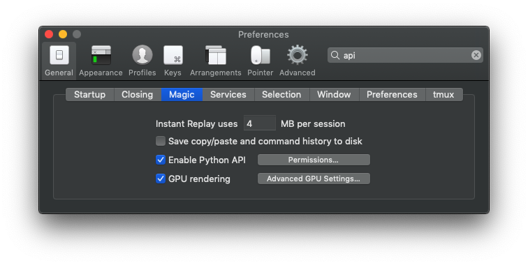

set-iterm2-background-color
===========================

These Python3 scripts will change the background color of the current iTerm session

# Set Up

## Install Dependencies

```bash
pip3 install iterm2
```

## Enable Python API for iTerm2



## Move Script to AutoLaunch dir

```bash
# create dir if it doesn't exist
mkdir  ~/Library/Application\ Support/iTerm2/Scripts/AutoLaunch/
# copy script
cp random-color.py  ~/Library/Application\ Support/iTerm2/Scripts/AutoLaunch/
```

